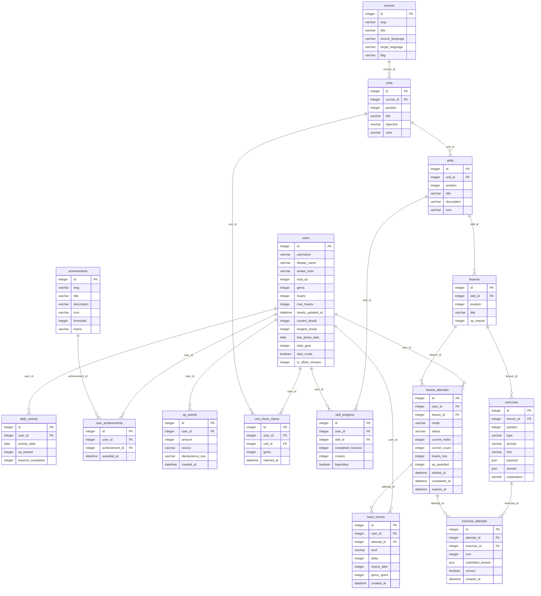

# Duolingo_clone

> Built for the **Scaler AI Labs online assessment (SDE Full-stack)**. It is an individual assessment submission: please do not copy, reuse or resubmit it as your own work.

A full-stack clone of the Duolingo web app: a learning path with locked/available/completed skills, a lesson player with five exercise types, hearts, XP, streaks, a weekly league, quests, achievements and a profile. The focus is the lesson loop and the gamification rules, all enforced on the server.

**Live demo:** added to the submission form  ·  **API docs:** `/api/docs` on the backend

## Features
**Core:** learning path (units, skills, lock/unlock, progress rings, crowns, reward chests) · lesson player with multiple choice, word bank, match pairs, fill in the blank and type-the-answer · immediate feedback bar and progress bar · hearts (lose one per mistake, out-of-hearts flow) · XP, daily goal, streak, leaderboard · persistence in SQLite · seeded course and sample learner · profile with stats and achievements · modals, toasts, celebratory states, settings.

**Duolingo behaviour worth knowing:** a wrong or skipped exercise comes back at the end of the lesson and the lesson only finishes when every exercise has been answered correctly; only correct answers fill the progress bar.

**Bonus:** text-to-speech audio and synthesised sound effects · achievements and badges · real weekly leaderboard across seeded learners · timed "Legendary" challenge (75 s, enforced by the server) · light and dark themes · responsive layout.

**Placeholders ("coming soon" toasts):** Super subscription, friends, Stories/Listening practice, speech recognition, extra courses, login.

## Tech stack
| Layer | Technology |
|---|---|
| Frontend | Next.js 16 (App Router), React 19, TypeScript |
| Backend | Python 3.12, FastAPI, SQLAlchemy 2, Pydantic 2 |
| Database | SQLite |
| Tests | pytest (113 tests), Ruff, ESLint, `tsc` |
| Deployment | Docker Compose (backend, frontend, Caddy reverse proxy) |

## Quick start
**Backend** (port 8000)
```bash
cd backend
python -m venv .venv && source .venv/bin/activate
pip install -r requirements-dev.txt
uvicorn app.main:app --reload --port 8000
```
The database (`backend/duolingo.db`) is created and seeded on first start.

**Frontend** (port 3000, proxies `/api/*` to the backend)
```bash
cd frontend
npm ci
npm run dev        # http://localhost:3000/learn
```
Set `BACKEND_INTERNAL_URL` if the backend is not on `http://127.0.0.1:8000`.

**Everything in Docker**
```bash
cp .env.example .env     # optional: APP_ADDRESS, PUBLIC_ORIGIN, DATA_DIR
docker compose up -d --build
# open http://localhost  (SQLite lives in ./data)
```

**Checks**
```bash
cd backend && PYTHONPATH=. pytest -q && ruff check app tests
cd frontend && npm run lint && npm run typecheck && npm run build
```

**Demo tools** (Settings → Demo tools, or the API): *Next day* simulates a day passing (streak, daily goal, heart regeneration); *Reset* restores the seeded learner. Set `ENABLE_DEV_ENDPOINTS=0` to disable both.

## Architecture
```
Browser ── Next.js (React, TypeScript) ──/api/*──▶ FastAPI ──▶ services ──▶ SQLAlchemy ──▶ SQLite
                 pages · components · hooks         routers      all rules       models + constraints
```
- **Backend layering** (`backend/app`): `api/routes` (thin HTTP handlers) → `services/` (every business rule: `attempts`, `hearts`, `streaks`, `path`, `leaderboard`, `daily`, `chests`, …) → `models.py` (tables, enums, CHECK constraints). `schemas.py` validates requests and types every response. All services take an explicit `user_id`, and time is read through one clock module, which is what makes the day logic testable.
- **Server-authoritative:** the browser never decides correctness, hearts, XP, streaks or unlocks. Lesson-start payloads contain no answers and option order is shuffled per attempt.
- **Lesson attempt state machine:** start/resume → answer (checked on the server; a wrong answer re-queues its exercise and, in lesson mode, costs a heart) → complete. Completion claims the attempt atomically (`UPDATE … WHERE status='active'`), so double submits and races award XP exactly once; XP events carry an idempotency key.
- **Derived state:** skill unlock state and the chest state are computed from progress, never stored; hearts regenerate lazily (one per 30 minutes) on read.
- **Dates:** a streak day is the learner's own calendar day (the browser reports its UTC offset once); the weekly league resets Monday 00:00 UTC.
- **Frontend** (`frontend/src`): `components/lesson/` (session hook, display components, one file per exercise type, dialogs), `components/learn/` (path, stats popovers, right rail), `components/pages/` (one component per page), shared `Toast`/`Modal`, `lib/api.ts` + `lib/types.ts` for the typed API client.

## Database schema
15 tables; the diagram below is generated from the SQLAlchemy models.



| Area | Tables | Notes |
|---|---|---|
| Content | `courses`, `units`, `skills`, `lessons`, `exercises` | Ordered by `position`; exercise `payload`/`answer` are JSON, `type` is one of five values |
| Learner | `users` | Hearts, gems, XP, streak counters, daily goal, theme, timezone offset |
| Progress | `skill_progress`, `lesson_attempts`, `exercise_attempts`, `daily_activity`, `unit_chest_claims` | An attempt has one row per submitted answer (`turn`), so retries are recorded |
| Gamification | `xp_events`, `heart_events`, `achievements`, `user_achievements` | Append-only XP and heart ledgers; weekly league = XP events since Monday |

Integrity is enforced in the database: foreign keys with cascades, unique constraints (e.g. one progress row per user/skill, one chest claim per user/unit) and CHECK constraints (hearts between 0 and max, non-negative XP and gems, valid status/mode/type values). Existing databases are upgraded on startup (new tables, columns and indexes are added and defaults back-filled).

## API overview
Base path `/api/v1`; interactive docs at `/api/docs`.

| Method | Path | Purpose |
|---|---|---|
| `GET` | `/health` | Health |
| `GET` | `/bootstrap` | Bootstrap |
| `GET` | `/courses/{course_id}/path` | Course Path |
| `POST` | `/units/{unit_id}/chest` | Open Unit Chest |
| `GET` | `/me` | Me |
| `PATCH` | `/me/settings` | Patch Settings |
| `GET` | `/me/profile` | Profile |
| `GET` | `/me/activity` | Activity |
| `POST` | `/lessons/{lesson_id}/attempts` | Create Attempt |
| `GET` | `/attempts/{attempt_id}` | Read Attempt |
| `POST` | `/attempts/{attempt_id}/answers` | Submit Answer |
| `POST` | `/attempts/{attempt_id}/complete` | Complete Attempt |
| `POST` | `/attempts/{attempt_id}/abandon` | Abandon Attempt |
| `GET` | `/leaderboards/weekly` | Weekly Leaderboard |
| `GET` | `/achievements` | Achievements |
| `GET` | `/quests` | Quests |
| `GET` | `/hearts` | Hearts |
| `POST` | `/hearts/practice-refill` | Hearts Practice Refill |
| `POST` | `/hearts/gem-refill` | Hearts Gem Refill |
| `POST` | `/dev/reset` | Reset the demo learner |
| `POST` | `/dev/simulate-day` | Pretend one day has passed |

Typical lesson flow: `POST /lessons/{id}/attempts` → `POST /attempts/{id}/answers` (repeat until `ready_to_complete`) → `POST /attempts/{id}/complete`.

## Seed data
One course (Spanish for English speakers), 2 units, 12 skills, 12 lessons and 60 exercises (twelve of each type), six learners (the demo learner "Alex" starts with 185 XP, 4 hearts, a 7-day streak and the first skill completed) and 6 achievements.

## Assumptions and limitations
- **One demo learner.** The assignment allows a default logged-in learner; every service already takes a `user_id`, so adding login only changes `current_user_id`.
- **SQLite** is used as required. On a host without a persistent disk the data resets when the server restarts and is re-seeded.
- The league's other players are simulated: they earn a fixed amount of XP each week.
- Spanish is the only course; speech recognition, friends, Super and stories are placeholders.
- Artwork: lesson characters and rank medals are original SVGs drawn for this project; other icons and illustrations are static assets in `frontend/public/*-assets`.

## Assessment note
This repository is my submission for the Scaler AI Labs online assessment. The brief (learning path, lesson player with five exercise types, hearts/XP/streak/leaderboard gamification, seeded content, profile, Duolingo-style experience, placeholders, and the optional audio, achievements, Legendary mode, dark mode and responsive bonuses) is covered as described above. It is a personal learning project and is not affiliated with or endorsed by Duolingo.

## License
Released under the [MIT License](LICENSE) © 2026 D-Deadric-C. The licence applies to the source code; the assessment note above still applies: this is an individual assessment submission and must not be copied or submitted by anyone else.
